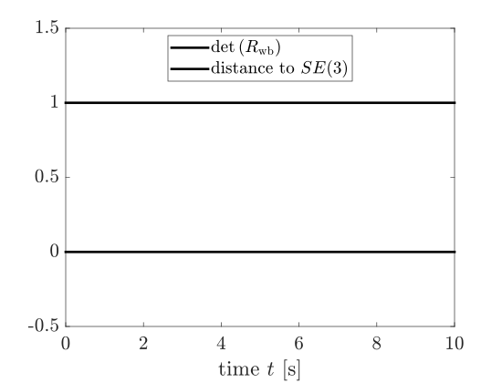

# geometric_rigid_body_dynamics

This repo demonstrates a "geometric integrator", i.e., a numerical integrator that preserves certain geometric properties of the space in which integration is performed.

I coded up the geometric integrator proposed by [Crouch and Grossman (J. Nonlinear Sci., 1993)](https://doi.org/10.1007/BF02429858) to simulate the motion of a rigid body in 3D space. See [docs/geometric_integration_rigid_body_dyn.pdf](docs/geometric_integration_rigid_body_dyn.pdf) for details. See [`cg4.m`](src/MATLAB/cg4.m) for implementation.

This repo uses the [Modern Robotics code library](https://github.com/NxRLab/ModernRobotics) and much of the notation comes from [_Modern Robotics_](https://hades.mech.northwestern.edu/index.php/Modern_Robotics) by Kevin Lynch and Frank Park.
I intend this repo to serve as an extension of certain topics in that text, mainly section 8.2.2 (twist-wrench formulation of the dynamics of a single rigid body).

## Illustrative Results
To test the CG4 integrator, I used the following parameters and initial conditions:
* mass: 1 kg
* body geometry: cube with side length 10 cm (you can compute the inertia tensor from this information)
* gravity: 9.81 m/s^2
* timestep size: 1e-3 s
* simulation duration: 10 s
* initial configuration: $T_\mathrm{wb} = I_{4\times4}$
* initial body twist: $\mathcal{V}_\mathrm{b}(0) = [1,2,3,1,2,3]^{\top}$.

Note: the CG4 integrator performs similarly with initial body twist several orders of magnitude larger, indicating its numerical stability.

### Kinematics

###  Energy is conserved

### Momentum is conserved - in some sense

Angular momentum is conserved in the body frame but not in the world frame.
Conversely, linear momentum is conserved in the world frame but not in the body frame.
These results make sense in light of gravity exerting a constant influence on the body, causing it to accelerate downward relative to the world frame.

### The configuration stays in SE(3)

One metrics for how well the numerical integrator preserves the geometry of the problem is the determinant of $R_\mathrm{wb}$ (the rotational component of configuration $T_\mathrm{wb}$). Specifically, $\det\left(R_\mathrm{wb}\right)$ should equal $1$ for all time and, sure enough, it does.

The Modern Robotics library also provides a function [`DistanceToSE3()`](https://github.com/NxRLab/ModernRobotics/blob/master/packages/MATLAB/mr/DistanceToSE3.m) that uses the Frobenius norm to compute a metric for how close $T_\mathrm{wb}$ is to $SE(3)$; from the plot above, $T_\mathrm{wb}$ stays in $SE(3)$ for all time.